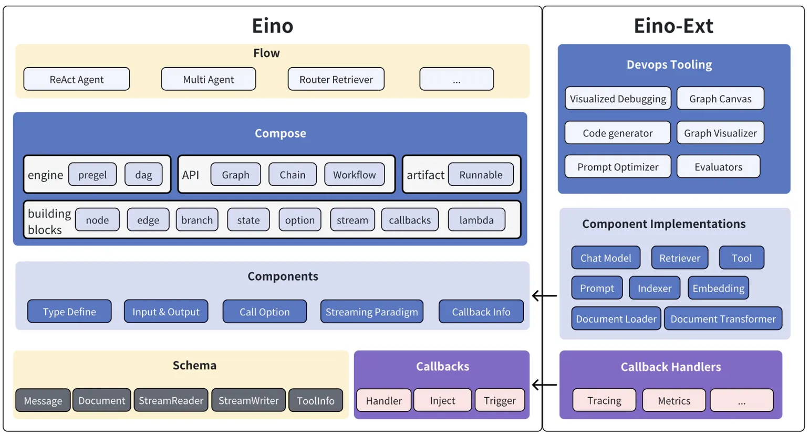
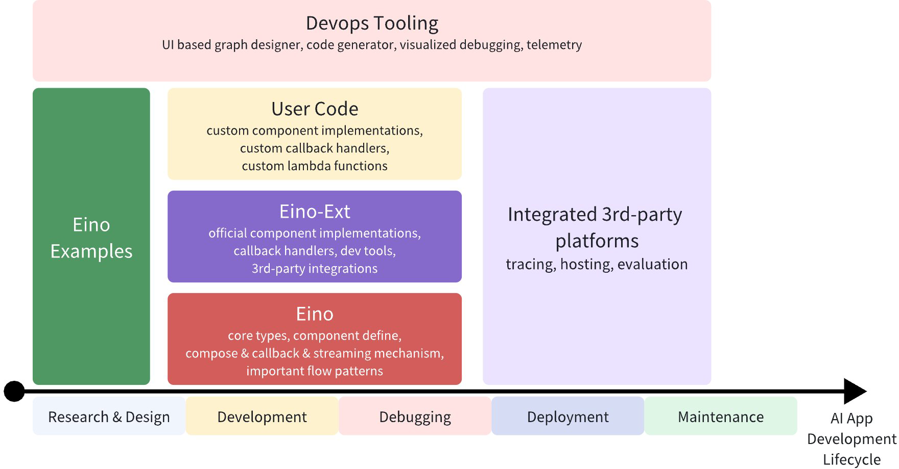
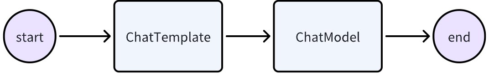
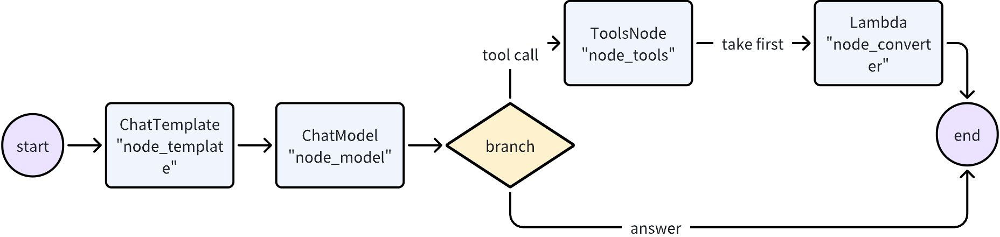
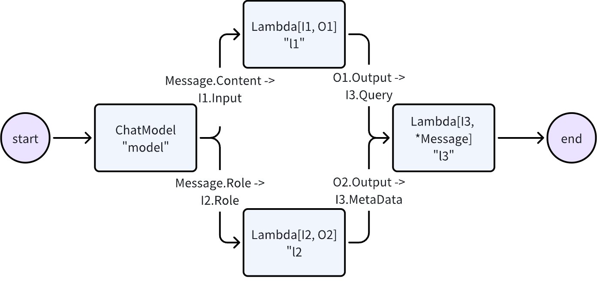
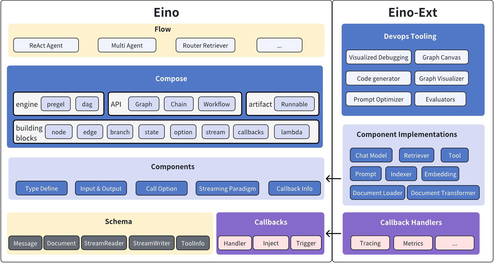

# 资料

```
文档：https://www.cloudwego.io/zh/docs/eino/overview/eino_open_source/
github：https://github.com/cloudwego/eino
```


Eino提供了一个强调简洁性、可扩展性、可靠性与有效性，且更符合 Go 语言编程惯例的 LLM 应用开发框架。

Eino框架有以下几个核心特点：

- **高可维护性和高可扩展性并存**：Eino框架基于Go 1.18版本引入的泛型，通过强类型定义各个节点的输入输出类型，并在编译时进行类型校验。这种设计既避免了传统框架使用interface{}带来的维护困难，又保持了良好的扩展性。强类型系统可以在编译期发现类型不匹配问题，有效避免运行时错误，显著提升代码的稳定性和可维护性。
- **丰富的开箱即用组件**：框架提供了从基础到高级的完整组件生态。在基础层面，包含了ChatModel、Tool、ChatTemplate等原子级执行节点；在高级层面，封装了ReAct Agent、MultiQueryRetriever等复杂业务逻辑组件。这些预置组件可以满足大多数AI应用场景的需求，极大降低了开发成本。
- **简单易用的开发体验**：框架配备了可视化开发工具EinoDev，支持通过图形界面快速搭建和调试Agent应用。同时在eino-examples仓库中提供了丰富的示例代码，覆盖了常见的使用场景和最佳实践。这些工具和资源大大降低了框架的学习门槛，帮助开发者快速上手。

 

Eino 框架由以下几个部分组成，其中Eino为核心框架逻辑，包含类型定义、流处理机制、组件抽象、编排功能、切面机制等，Eino-Ext为一些具体组件的实现，例如DeepSeek ChatModel、Langfuse Callbacks等。



 

## 介绍视频

> [编排优先——Go 语言开发 AI 智能体的设计与实现-沈桐](https://www.bilibili.com/video/BV186Z7YQEhU/)
>
> 2025 年 1 月，基于 Golang 的大模型应用综合开发框架 Eino 在 CloudWeGo 正式开源。Eino 基于明确的“组件”定义，提供强大的流程“编排”，覆盖开发全流程，旨在帮助开发者以最快的速度实现最有深度的大模型应用。目前，Eino 已成为字节跳动内部大模型应用的首选全代码开发框架，已有包括豆包、抖音、扣子等多条业务线、数百个服务接入使用。 本次演讲分享了 Eino 的技术实践，展示大模型与微服务如何深度融合，为开发者提供高效、稳定的“AI+微服务”一体化解决方案。


> 组件


Retriever 知识库


> 编排


> 数据流处理


> 架构图


==》 compose 组件使用


> 需求例子


==》主要先看下compose 编排。。

RAG能力。。（知识库）


> 03 现状


# Eino: 概述

## 概述

**Eino[‘aino]** (近似音: i know，希望框架能达到 “i know” 的愿景) 旨在提供基于 Golang 语言的终极大模型应用开发框架。 

它从开源社区中的诸多优秀 LLM 应用开发框架，如 LangChain 和 LlamaIndex 等获取灵感，同时借鉴前沿研究成果与实际应用，提供了一个强调简洁性、可扩展性、可靠性与有效性，且更符合 Go 语言编程惯例的 LLM 应用开发框架。

Eino 提供的价值如下：

- 精心整理的一系列 **组件（component）** 抽象与实现，可轻松复用与组合，用于构建 LLM 应用。
- 强大的 **编排（orchestration）** [/ˌɔrkɪ'streɪʃn/] 框架，为用户承担繁重的类型检查、流数据处理、并发管理、切面注入、选项赋值等工作。
- 一套精心设计、注重简洁明了的 **API**。
- 以集成 **流程（flow）** 和 **示例（example）** 形式不断扩充的最佳实践集合。
- 一套实用 **工具（DevOps tools）**，涵盖从可视化开发与调试到在线追踪与评估的整个开发生命周期。

借助上述能力和工具，Eino 能够在人工智能应用开发生命周期的不同阶段实现标准化、简化操作并提高效率：



### 快速上手

直接使用组件：

```go
model, _ := openai.NewChatModel(ctx, config) // create an invokable LLM instance
message, _ := model.Generate(ctx, []*Message{
    SystemMessage("you are a helpful assistant."),
    UserMessage("what does the future AI App look like?")})
```

当然，你可以这样用，Eino 提供了许多开箱即用的有用组件。但通过使用编排功能，你能实现更多，原因有三：

- 编排封装了大语言模型（LLM）应用的常见模式。
- 编排解决了处理大语言模型流式响应这一难题。
- 编排为你处理类型安全、并发管理、切面注入以及选项赋值等问题。

Eino 提供了三组用于编排的 API：

| API      | 特性和使用场景                                 |
| -------- | ---------------------------------------------- |
| Chain    | 简单的链式有向图，只能向前推进。               |
| Graph    | 有向有环或无环图。功能强大且灵活。             |
| Workflow | 有向无环图，支持在结构体字段级别进行数据映射。 |

我们来创建一个简单的 chain: 一个模版（ChatTemplate）接一个大模型（ChatModel）。



```go
chain, _ := NewChain[map[string]any, *Message]().
           AppendChatTemplate(prompt).
           AppendChatModel(model).
           Compile(ctx)
chain.Invoke(ctx, map[string]any{"query": "what's your name?"})
```


现在，我们来创建一个 Graph，一个 ChatModel，要么直接输出结果，要么最多调一次 Tool。



```go
graph := NewGraph[map[string]any, *schema.Message]()

_ = graph.AddChatTemplateNode("node_template", chatTpl)
_ = graph.AddChatModelNode("node_model", chatModel)
_ = graph.AddToolsNode("node_tools", toolsNode)
_ = graph.AddLambdaNode("node_converter", takeOne)

_ = graph.AddEdge(START, "node_template")
_ = graph.AddEdge("node_template", "node_model")
_ = graph.AddBranch("node_model", branch)
_ = graph.AddEdge("node_tools", "node_converter")
_ = graph.AddEdge("node_converter", END)

compiledGraph, err := graph.Compile(ctx)
if err != nil {
    return err
}
out, err := compiledGraph.Invoke(ctx, map[string]any{
    "query":"Beijing's weather this weekend"})

```


现在，我们来创建一个 Workflow，它能在字段级别灵活映射输入与输出：



```go
wf := NewWorkflow[[]*Message, *Message]()
wf.AddChatModelNode("model", model).AddInput(START)
wf.AddLambdaNode("l1", lambda1).AddInput("model", MapFields("Content", "Input"))
wf.AddLambdaNode("l2", lambda2).AddInput("model", MapFields("Role", "Role"))
wf.AddLambdaNode("l3", lambda3).AddInput("l1", MapFields("Output", "Query")).
    AddInput("l2", MapFields("Output", "MetaData"))
wf.AddEnd("node_l3")
runnable, _ := wf.Compile(ctx)
runnable.Invoke(ctx, []*Message{UserMessage("kick start this workflow!")})

```


现在，咱们来创建一个 “ReAct” 智能体：一个 ChatModel 绑定了一些 Tool。它接收输入的消息，自主判断是调用 Tool 还是输出最终结果。Tool 的执行结果会再次成为聊天模型的输入消息，并作为下一轮自主判断的上下文。

我们在 Eino 的 `flow` 包中提供了开箱即用的 ReAct 智能体的完整实现。代码参见： [flow/agent/react](https://github.com/cloudwego/eino/blob/main/flow/agent/react/react.go)

Eino 会在上述代码背后自动完成一些重要工作：

- **类型检查**：在编译时确保两个节点的输入和输出类型匹配。
- **流处理**：如有需要，在将消息流传递给 ChatModel 和 ToolsNode 节点之前进行拼接，以及将该流复制到 callback handler 中。
- **状态管理**：确保共享的 state 可以被安全地读写。
- **切面注入**：如果指定的 ChatModel 实现未自行注入，会在 ChatModel 执行之前和之后注入回调切面。
- **选项赋值**：运行时 Option 可以全局设置，也可以针对特定组件类型或特定节点进行设置。

例如，你可以轻松地通过回调扩展已编译的图：

```go
handler := NewHandlerBuilder().
  OnStartFn(
    func(ctx context.Context, info *RunInfo, input CallbackInput) context.Context) {
        log.Infof("onStart, runInfo: %v, input: %v", info, input)
    }).
  OnEndFn(
    func(ctx context.Context, info *RunInfo, output CallbackOutput) context.Context) {
        log.Infof("onEnd, runInfo: %v, out: %v", info, output)
    }).
  Build()
  
compiledGraph.Invoke(ctx, input, WithCallbacks(handler))

```

或者你可以轻松地为不同节点分配选项：

```go
// assign to All nodes
compiledGraph.Invoke(ctx, input, WithCallbacks(handler))

// assign only to ChatModel nodes
compiledGraph.Invoke(ctx, input, WithChatModelOption(WithTemperature(0.5))

// assign only to node_1
compiledGraph.Invoke(ctx, input, WithCallbacks(handler).DesignateNode("node_1"))

```


### 关键特性

> #### 丰富的组件(Component)

- 将常见的构建模块抽象为组件，每个组件抽象都有多个可开箱即用的组件实现
  - 诸如聊天模型（ChatModel）、工具（Tool）、提示模板（PromptTemplate）、检索器（Retriever）、文档加载器（Document Loader）、Lambda 等组件抽象。
  - 每种组件类型都有其自身的接口：定义了输入和输出类型、定义了选项类型，以及合理的流处理范式。
  - 实现细节是透明的。在编排组件时，你只需关注抽象层面。
- 实现可以嵌套，并包含复杂的业务逻辑。
  - ReAct 智能体（React Agent）、多查询检索器（MultiQueryRetriever）、主机多智能体（Host MultiAgent）等。它们由多个组件和复杂的业务逻辑构成。
  - 从外部看，它们的实现细节依然透明。例如在任何接受 Retriever 的地方，都可以使用 MultiQueryRetriever。


> ### 强大的编排 (Graph/Chain/Workflow)

- 数据从 Retriever / Document Loader / ChatTemplate 流向 ChatModel，接着流向 Tool ，并被解析为最终答案。这种通过多个组件的有向、可控的数据流，可以通过**图编排**来实现。
- 组件实例是图的 **节点（Node）** ，而 **边（Edge）** 则是数据流通道。
- 图编排功能强大且足够灵活，能够实现复杂的业务逻辑：
  - **类型检查、流处理、并发管理、切面注入和选项分配**都由框架处理。
  - 在运行时进行**分支（Branch）\**执行、读写全局\**状态（State）**，或者使用工作流进行字段级别的数据映射。

> ### 完善的流处理(Streaming)

- 流数据处理（Stream Processing）很重要，因为 ChatModel 在生成消息时会实时输出完整消息的各个分片。在编排场景下会尤为重要，因为更多的组件需要处理分片的消息数据。
- 对于只接受非流式输入的下游节点（如 ToolsNode），Eino 会自动将流 **拼接（Concatenate）** 起来。
- 在图的执行过程中，当需要流时，Eino 会自动将非流式**转换**为流式。
- 当多个流汇聚到一个下游节点时，Eino 会自动 **合并（Merge）** 这些流。
- 当一个流传入到多个不同的下游节点或传递给回调处理器时，Eino 会自动 **复制（Copy）** 这些流。
- 如 **分支（Branch）** 、或 **状态处理器（StateHandler）** 等编排元素，也能够感知和处理流。
- 借助上述流数据处理能力，组件本身的“是否能处理流、是否会输出流”变的对用户透明。
- 经过编译的 Graph 可以用 4 种不同的流输入输出范式来运行：

| 流处理范式 | 解释                                                     |
| ---------- | -------------------------------------------------------- |
| Invoke     | 接收非流类型 I ，返回非流类型 O                          |
| Stream     | 接收非流类型 I ， 返回流类型 StreamReader[O]             |
| Collect    | 接收流类型 StreamReader[I] ， 返回非流类型 O             |
| Transform  | 接收流类型 StreamReader[I] ， 返回流类型 StreamReader[O] |


> ### 易扩展的的切面(Callbacks)

- 切面用于处理诸如日志记录、追踪、指标统计等横切面关注点，同时也用于暴露组件实现的内部细节。
- 支持五种切面：**OnStart、OnEnd、OnError、OnStartWithStreamInput、OnEndWithStreamOutput**。
- 开发者可以轻松创建自定义回调处理程序，在图运行期间通过 Option 添加它们，这些处理程序会在图运行时被调用。
- 图还能将切面注入到那些自身不支持回调的组件实现中。


### Eino 框架结构

[](https://www.cloudwego.io/img/eino/eino_structure.png)

Eino 框架由几个部分组成：

- [Eino](https://github.com/cloudwego/eino)：包含类型定义、流数据处理机制、组件抽象定义、编排功能、切面机制等。
- [EinoExt](https://github.com/cloudwego/eino-ext)：组件实现、回调处理程序实现、组件使用示例，以及各种工具，如评估器、提示优化器等。

> 💡 针对字节内部使用的组件，有对应的内部代码仓库：
>
> EinoBytedExt: https://code.byted.org/search/flow/eino-byted-ext
>
> 包含当前定位为内部使用的组件实现，如 llmgateway, bytedgpt, fornax tracing, bytees 等。

- [Eino Devops](https://github.com/cloudwego/eino-ext/tree/main/devops)：可视化开发、可视化调试等。
- [EinoExamples](https://github.com/cloudwego/eino-examples)：是包含示例应用程序和最佳实践的代码仓库。

详见：[Eino 框架结构说明](/zh/docs/eino/overview/Eino 框架结构说明)


### 详细文档

针对 Eino 的学习和使用，我们提供了完善的 Eino 用户手册，帮助大家快速理解 Eino 中的概念，掌握基于 Eino 开发设计 AI 应用的技能，赶快通过 [Eino 用户手册](https://www.cloudwego.io/zh/docs/eino/)尝试使用吧~。

若想快速上手，了解 通过 Eino 构建 AI 应用的过程，推荐先阅读 [Eino: 快速开始](https://www.cloudwego.io/zh/docs/eino/quick_start/)

完整 API Reference：https://pkg.go.dev/github.com/cloudwego/eino

### 依赖说明

- Go 1.18 及以上版本
- Eino 依赖了 [kin-openapi](https://github.com/getkin/kin-openapi) 的 OpenAPI JSONSchema 实现。为了能够兼容 Go 1.18 版本，我们将 kin-openapi 的版本固定在了 v0.118.0。

### 安全

如果你在该项目中发现潜在的安全问题，或你认为可能发现了安全问题，请通过我们的[安全中心](https://security.bytedance.com/src)或[漏洞报告邮箱](mailto:sec@bytedance.com)通知字节跳动安全团队。

请**不要**创建公开的 GitHub Issue。

### 联系我们

- 如何成为 member: [COMMUNITY MEMBERSHIP](https://github.com/cloudwego/community/blob/main/COMMUNITY_MEMBERSHIP.md)
- Issues: [Issues](https://github.com/cloudwego/eino/issues)
- 飞书用户群


# Eino: 快速开始

## 实现一个最简 LLM 应用

本指南将帮助你快速上手使用 Eino 框架中的 ChatModel 构建一个简单的 LLM 应用。我们将通过实现一个"程序员鼓励师"的例子，来展示如何使用 ChatModel。

> 💡 本文中示例的代码片段详见：[eino-examples/quickstart/chat](https://github.com/cloudwego/eino-examples/blob/main/quickstart/chat)

### **ChatModel 简介**

ChatModel 是 Eino 框架中对对话大模型的抽象，它提供了统一的接口来与不同的大模型服务（如 OpenAI、Ollama 等）进行交互。

> 组件更详细的介绍参考： [Eino: ChatModel 使用说明](https://www.cloudwego.io/zh/docs/eino/core_modules/components/chat_model_guide)


### **Messages 的结构和使用**

在 Eino 中，对话是通过 `schema.Message` 来表示的，这是 Eino 对一个对话消息的抽象定义。每个 Message 包含以下重要字段：

- Role: 消息的角色，可以是：
  - `system`: 系统指令，用于设定模型的行为和角色
  - `user`: 用户的输入
  - `assistant`: 模型的回复
  - `tool`: 工具调用的结果
- `Content`: 消息的具体内容

### **实现程序员鼓励师**

让我们通过实现一个程序员鼓励师来学习如何使用 ChatModel。这个助手不仅能提供技术建议，还能在程序员感到难过时给予心理支持。

#### 创建对话模板并生成消息

Eino 提供了强大的模板化功能来构建要输入给大模型的消息：

1. 模版渲染，支持三种模版格式：
   - FString：Python 风格的简单字符串格式化（例如：“你好，{name}！"）
   - Jinja2：支持丰富表达式的 Jinja2 风格模板（例如：“你好，{{name}}！"）
   - GoTemplate：Go 语言内置的 **text/template 格式**（例如：“你好，{{.name}}！"）
2. 消息占位符：支持插入一组消息（如对话历史）

```go
// optional=false 表示必需的消息列表，在模版输入中找不到对应变量会报错
schema.MessagesPlaceholder("chat_history", false)
```

> 更详细的组件介绍可参考： [Eino: ChatTemplate 使用说明](https://www.cloudwego.io/zh/docs/eino/core_modules/components/chat_template_guide)

下面是完整的 FString 格式 + 消息占位符的对话模板创建及使用代码：

```go
// eino-examples/quickstart/chat/template.go

import (
    "context"

    "github.com/cloudwego/eino/components/prompt"
    "github.com/cloudwego/eino/schema"
)

// 创建模板，使用 FString 格式
template := prompt.FromMessages(schema.FString,
   // 系统消息模板
   schema.SystemMessage("你是一个{role}。你需要用{style}的语气回答问题。你的目标是帮助程序员保持积极乐观的心态，提供技术建议的同时也要关注他们的心理健康。"),

   // 插入需要的对话历史（新对话的话这里不填）
   schema.MessagesPlaceholder("chat_history", true),

   // 用户消息模板
   schema.UserMessage("问题: {question}"),
)

// 使用模板生成消息
messages, err := template.Format(context.Background(), map[string]any{
   "role":     "程序员鼓励师",
   "style":    "积极、温暖且专业",
   "question": "我的代码一直报错，感觉好沮丧，该怎么办？",
   // 对话历史（这个例子里模拟两轮对话历史）
   "chat_history": []*schema.Message{
      schema.UserMessage("你好"),
      schema.AssistantMessage("嘿！我是你的程序员鼓励师！记住，每个优秀的程序员都是从 Debug 中成长起来的。有什么我可以帮你的吗？", nil),
      schema.UserMessage("我觉得自己写的代码太烂了"),
      schema.AssistantMessage("每个程序员都经历过这个阶段！重要的是你在不断学习和进步。让我们一起看看代码，我相信通过重构和优化，它会变得更好。记住，Rome wasn't built in a day，代码质量是通过持续改进来提升的。", nil),
   },
})

```


#### 创建 ChatModel

ChatModel 是 Eino 框架中最核心的组件之一，它提供了与各种大语言模型交互的统一接口。Eino 目前支持以下大语言模型的实现：

- OpenAI：支持 GPT-3.5/GPT-4 等模型 (同样支持 azure 提供的 openai 服务)
- Ollama：支持本地部署的开源模型
- Ark：火山引擎上的模型服务 (例如字节的豆包大模型)
- 更多模型正在支持中

> 支持的模型可以参考：[Eino: 生态集成](https://www.cloudwego.io/zh/docs/eino/ecosystem_integration)

下面我们以 OpenAI 和 Ollama 为例，展示如何创建和使用 ChatModel：

##### **OpenAI (和下方 ollama 2 选 1)**

```go
// eino-examples/quickstart/chat/openai.go

import (
    "os"

    "github.com/cloudwego/eino-ext/components/model/openai"
)

chatModel, err := openai.NewChatModel(ctx, &openai.ChatModelConfig{
   Model:  "gpt-4o",                         // 使用的模型版本
   APIKey: os.Getenv("OPENAI_API_KEY"),      // OpenAI API 密钥
})
```

> OpenAI ChatModel 的详细信息可以参考：[ChatModel - OpenAI](https://www.cloudwego.io/zh/docs/eino/ecosystem_integration/chat_model/chat_model_openai)


##### **Ollama(和上方 openai 2 选 1)**

Ollama 支持在本地运行开源模型，适合对数据隐私有要求或需要离线使用的场景。

```go
// eino-examples/quickstart/chat/ollama.go

import (
    "github.com/cloudwego/eino-ext/components/model/ollama"
)


chatModel, err := ollama.NewChatModel(ctx, &ollama.ChatModelConfig{
    BaseURL: "http://localhost:11434", // Ollama 服务地址
    Model:   "llama2",                 // 模型名称
})
```

> 


##### 混元接入

> 兼容openai接口，直接参考即可

```go
package main

import (
	"context"
	"log"

	"github.com/cloudwego/eino-ext/components/model/openai"
	"github.com/cloudwego/eino/components/model"
)

func createHunyuanChatModel(ctx context.Context) model.ToolCallingChatModel {

	chatModel, err := openai.NewChatModel(ctx, &openai.ChatModelConfig{
        BaseURL: "http://hunyuanapi.xxxxxxx/openapi/v1",
		Model:   "hunyuan-t1-vision-latest",
		APIKey:  "xxxxxx",
	})
	if err != nil {
		log.Fatalf("create openai chat model failed, err=%v", err)
	}
	return chatModel
}
```

> OpenAI 相关信息，可以参考：[ChatModel - Ollama](https://www.cloudwego.io/zh/docs/eino/ecosystem_integration/chat_model/chat_model_ollama)

无论使用哪种实现，ChatModel 都提供了一致的接口，这意味着你可以轻松地在不同的模型之间切换，而无需修改大量代码。


#### 运行 ChatModel

经过前两步得到 ChatModel 的输入 messages 和初始化完成后的 ChatModel 实例后，可以开始尝试运行 ChatModel 了。Eino ChatModel 提供了两种运行模式：输出完整消息(generate)和输出消息流(stream)：

```go
// eino-examples/quickstart/chat/generate.go

/*** create messages
* messages, err := xxx
*/

/*** create chat model
* chatModel, err := xxx
*/ 

result, err := chatModel.Generate(ctx, messages)
streamResult, err := chatModel.Stream(ctx, messages)

```

示例代码：

```go
package main

import (
	"context"
	"log"

	"github.com/cloudwego/eino/components/model"
	"github.com/cloudwego/eino/schema"
)

func generate(ctx context.Context, llm model.ToolCallingChatModel, in []*schema.Message) *schema.Message {
	result, err := llm.Generate(ctx, in)
	if err != nil {
		log.Fatalf("llm generate failed: %v", err)
	}
	return result
}

func stream(ctx context.Context, llm model.ToolCallingChatModel, in []*schema.Message) *schema.StreamReader[*schema.Message] {
	result, err := llm.Stream(ctx, in)
	if err != nil {
		log.Fatalf("llm generate failed: %v", err)
	}
	
```


在实际应用中，有很多场景需要使用流式响应，主要的场景例如「提升用户体验」：stream 运行模式让 ChatModel 提供类似打字机的输出效果，使用户更早得到模型响应。

Eino 中对流式输出的处理方式如下：

```go
// eino-examples/quickstart/chat/stream.go

import (
    "io"
    "log"

    "github.com/cloudwego/eino/schema"
)

func reportStream(sr *schema.StreamReader[*schema.Message]) {
    defer sr.Close()

    i := 0
    for {
       message, err := sr.Recv()
       if err == io.EOF { // 流式输出结束
          return
       }
       if err != nil {
          log.Fatalf("recv failed: %v", err)
       }
       log.Printf("message[%d]: %+v\n", i, message)
       i++
    }
}

```

完整实现参见：[eino-examples/quickstart/chat/main.go](https://github.com/cloudwego/eino-examples/blob/main/quickstart/chat/main.go)

### **总结**

本示例通过一个程序员鼓励师的案例，展示了如何使用 Eino 框架构建 LLM 应用。从 ChatModel 的创建到消息模板的使用，再到实际的对话实现，相信你已经对 Eino 框架有了基本的了解。无论是选择 OpenAI、Ollama 还是其他模型实现，Eino 都提供了统一且简单的使用方式。希望这个示例能帮助你快速开始构建自己的 LLM 应用。


## Agent-让大模型拥有双手


### **Agent 是什么**

Agent（智能代理）是一个**能够感知环境并采取行动以实现特定目标**的系统。

在 AI 应用中，Agent 通过结合大语言模型的理解能力和预定义工具的执行能力，可以自主地完成复杂的任务。是未来 AI 应用到生活生产中主要的形态。

> 💡 本文中示例的代码片段详见：[eino-examples/quickstart/todoagent](https://github.com/cloudwego/eino-examples/blob/master/quickstart/todoagent/main.go)

### **Agent 的核心组成**

在 Eino 中，要实现 Agent 主要需要两个核心部分：ChatModel 和 Tool。

#### **ChatModel**[ ](https://www.cloudwego.io/zh/docs/eino/quick_start/agent_llm_with_tools/#chatmodel)

hatModel 是 Agent 的大脑，它通过强大的语言理解能力来处理用户的自然语言输入。当用户提出请求时，ChatModel 会深入理解用户的意图，分析任务需求，并决定是否需要调用特定的工具来完成任务。在需要使用工具时，它能够准确地选择合适的工具并生成正确的参数。不仅如此，ChatModel 还能将工具执行的结果转化为用户易于理解的自然语言回应，实现流畅的人机对话。

> 更详细的 ChatModel 的信息，可以参考： [Eino: ChatModel 使用说明](https://www.cloudwego.io/zh/docs/eino/core_modules/components/chat_model_guide)


#### **Tool**

Tool 是 Agent 的执行器，提供了具体的功能实现。每个 Tool 都有明确的功能定义和参数规范，使 ChatModel 能够准确地调用它们。Tool 可以实现各种功能，从简单的数据操作到复杂的外部服务调用都可以封装成 Tool。

> 更详细关于 Tool 和 ToolsNode 的信息，可参考： [Eino: ToolsNode 使用说明](https://www.cloudwego.io/zh/docs/eino/core_modules/components/tools_node_guide)


### **Tool 的实现方式**

在 Eino 中，我们提供了多种方式来实现 Tool。下面通过一个待办事项（Todo）管理系统的例子来说明。

#### **方式一：使用 NewTool 构建**[ ](https://www.cloudwego.io/zh/docs/eino/quick_start/agent_llm_with_tools/#方式一使用-newtool-构建)

这种方式适合简单的工具实现，通过定义工具信息和**处理函数**来创建 Tool：

```go
import (
    "context"

    "github.com/cloudwego/eino/components/tool"
    "github.com/cloudwego/eino/components/tool/utils"
    "github.com/cloudwego/eino/schema"
)

// 处理函数
func AddTodoFunc(_ context.Context, params *TodoAddParams) (string, error) {
    // Mock处理逻辑
    return `{"msg": "add todo success"}`, nil
}

func getAddTodoTool() tool.InvokableTool {
    // 工具信息
    info := &schema.ToolInfo{
        Name: "add_todo",
        Desc: "Add a todo item",
        ParamsOneOf: schema.NewParamsOneOfByParams(map[string]*schema.ParameterInfo{
            "content": {
                Desc:     "The content of the todo item",
                Type:     schema.String,
                Required: true,
            },
            "started_at": {
                Desc: "The started time of the todo item, in unix timestamp",
                Type: schema.Integer,
            },
            "deadline": {
                Desc: "The deadline of the todo item, in unix timestamp",
                Type: schema.Integer,
            },
        }),
    }

    // 使用NewTool创建工具
    return utils.NewTool(info, AddTodoFunc)
}
```

这种方式虽然直观，但存在一个明显的缺点：需要在 ToolInfo 中手动定义参数信息（ParamsOneOf），和实际的参数结构（TodoAddParams）是分开定义的。这样不仅造成了代码的冗余，而且在参数发生变化时需要同时修改两处地方，容易导致不一致，维护起来也比较麻烦。


#### **方式二：使用 InferTool 构建**

这种方式更加简洁，通过结构体的 tag 来定义参数信息，就能实现参数结构体和描述信息同源，无需维护两份信息：

```go
import (
    "context"

    "github.com/cloudwego/eino/components/tool/utils"
)

// 参数结构体
type TodoUpdateParams struct {
    ID        string  `json:"id" jsonschema:"description=id of the todo"`
    Content   *string `json:"content,omitempty" jsonschema:"description=content of the todo"`
    StartedAt *int64  `json:"started_at,omitempty" jsonschema:"description=start time in unix timestamp"`
    Deadline  *int64  `json:"deadline,omitempty" jsonschema:"description=deadline of the todo in unix timestamp"`
    Done      *bool   `json:"done,omitempty" jsonschema:"description=done status"`
}

// 处理函数
func UpdateTodoFunc(_ context.Context, params *TodoUpdateParams) (string, error) {
    // Mock处理逻辑
    return `{"msg": "update todo success"}`, nil
}

// 使用 InferTool 创建工具
updateTool, err := utils.InferTool(
    "update_todo", // tool name 
    "Update a todo item, eg: content,deadline...", // tool description
    UpdateTodoFunc)
```


#### **方式三：实现 Tool 接口**

对于需要更多自定义逻辑的场景，可以通过实现 Tool 接口来创建：

```go
import (
    "context"

    "github.com/cloudwego/eino/components/tool"
    "github.com/cloudwego/eino/schema"
)

type ListTodoTool struct {}

func (lt *ListTodoTool) Info(ctx context.Context) (*schema.ToolInfo, error) {
    return &schema.ToolInfo{
        Name: "list_todo",
        Desc: "List all todo items",
        ParamsOneOf: schema.NewParamsOneOfByParams(map[string]*schema.ParameterInfo{
            "finished": {
                Desc:     "filter todo items if finished",
                Type:     schema.Boolean,
                Required: false,
            },
        }),
    }, nil
}

func (lt *ListTodoTool) InvokableRun(ctx context.Context, argumentsInJSON string, opts ...tool.Option) (string, error) {
    // Mock调用逻辑
    return `{"todos": [{"id": "1", "content": "在2024年12月10日之前完成Eino项目演示文稿的准备工作", "started_at": 1717401600, "deadline": 1717488000, "done": false}]}`, nil
}

```


#### **方式四：使用官方封装的工具**

除了自己实现工具，我们还提供了许多开箱即用的工具。这些工具经过充分测试和优化，可以直接集成到你的 Agent 中。以 duckduckgo Search 工具为例：

```go
import (
    "github.com/cloudwego/eino-ext/components/tool/duckduckgo"
)


// 创建 duckduckgo Search 工具
searchTool, err := duckduckgo.NewTool(ctx, &duckduckgo.Config{})

```

使用 eino-ext 提供的工具不仅能避免重复开发的工作量，还能确保工具的稳定性和可靠性。这些工具都经过充分测试和持续维护，可以直接集成到项目中使用。


### **用 Chain 构建 Agent**

在构建 Agent 时，ToolsNode 是一个核心组件，它负责管理和执行工具调用。

ToolsNode 可以集成多个工具，并提供统一的调用接口。它支持**同步调用（Invoke）和流式调用（Stream）**两种方式，能够灵活地处理不同类型的工具执行需求。

要创建一个 ToolsNode，你需要提供一个工具列表配置：

```go
import (
    "context"

    "github.com/cloudwego/eino/components/tool"
    "github.com/cloudwego/eino/compose"
)

conf := &compose.ToolsNodeConfig{
    Tools: []tool.BaseTool{tool1, tool2},  // 工具可以是 InvokableTool 或 StreamableTool
}
toolsNode, err := compose.NewToolNode(context.Background(), conf)

```

下面是一个完整的 Agent 示例，它使用 OpenAI 的 ChatModel 并结合了上述的 Todo 工具:

```go
import (
    "context"
    "fmt"
    "log"
    "os"

    "github.com/cloudwego/eino-ext/components/model/openai"
    "github.com/cloudwego/eino/components/tool"
    "github.com/cloudwego/eino/compose"
    "github.com/cloudwego/eino/schema"
)

func main() {
    // 初始化 tools
    todoTools := []tool.BaseTool{
        getAddTodoTool(),                               // NewTool 构建
        updateTool,                                     // InferTool 构建
        &ListTodoTool{},                                // 实现Tool接口
        searchTool,                                     // 官方封装的工具
    }

    // 创建并配置 ChatModel
    chatModel, err := openai.NewChatModel(context.Background(), &openai.ChatModelConfig{
        Model:       "gpt-4",
        APIKey:      os.Getenv("OPENAI_API_KEY"),
    })
    if err != nil {
        log.Fatal(err)
    }
    // 获取工具信息并绑定到 ChatModel
    toolInfos := make([]*schema.ToolInfo, 0, len(todoTools))
    for _, tool := range todoTools {
        info, err := tool.Info(ctx)
        if err != nil {
            log.Fatal(err)
        }
        toolInfos = append(toolInfos, info)
    }
    err = chatModel.BindTools(toolInfos)
    if err != nil {
        log.Fatal(err)
    }


    // 创建 tools 节点
    todoToolsNode, err := compose.NewToolNode(context.Background(), &compose.ToolsNodeConfig{
        Tools: todoTools,
    })
    if err != nil {
        log.Fatal(err)
    }

    // 构建完整的处理链!!!
    chain := compose.NewChain[[]*schema.Message, []*schema.Message]()
    chain.
        AppendChatModel(chatModel, compose.WithNodeName("chat_model")).
        AppendToolsNode(todoToolsNode, compose.WithNodeName("tools"))

    // 编译并运行 chain
    agent, err := chain.Compile(ctx)
    if err != nil {
        log.Fatal(err)
    }

    // 运行示例
    resp, err := agent.Invoke(ctx, []*schema.Message{
        {
           Role:    schema.User,
           Content: "添加一个学习 Eino 的 TODO，同时搜索一下 cloudwego/eino 的仓库地址",
        },
    })
    if err != nil {
        log.Fatal(err)
    }

    // 输出结果
    for _, msg := range resp {
        fmt.Println(msg.Content)
    }
}

```

工具代码：

```go
// 获取添加 todo 工具
// 使用 utils.NewTool 创建工具
func getAddTodoTool() tool.InvokableTool {
	info := &schema.ToolInfo{
		Name: "add_todo",
		Desc: "Add a todo item",
		ParamsOneOf: schema.NewParamsOneOfByParams(map[string]*schema.ParameterInfo{
			"content": {
				Desc:     "The content of the todo item",
				Type:     schema.String,
				Required: true,
			},
			"started_at": {
				Desc: "The started time of the todo item, in unix timestamp",
				Type: schema.Integer,
			},
			"deadline": {
				Desc: "The deadline of the todo item, in unix timestamp",
				Type: schema.Integer,
			},
		}),
	}

	return utils.NewTool(info, AddTodoFunc)
}

// ListTodoTool
// 获取列出 todo 工具
// 自行实现 InvokableTool 接口
type ListTodoTool struct{}

func (lt *ListTodoTool) Info(_ context.Context) (*schema.ToolInfo, error) {
	return &schema.ToolInfo{
		Name: "list_todo",
		Desc: "List all todo items",
		ParamsOneOf: schema.NewParamsOneOfByParams(map[string]*schema.ParameterInfo{
			"finished": {
				Desc:     "filter todo items if finished",
				Type:     schema.Boolean,
				Required: false,
			},
		}),
	}, nil
}

type TodoUpdateParams struct {
	ID        string  `json:"id" jsonschema:"description=id of the todo"`
	Content   *string `json:"content,omitempty" jsonschema:"description=content of the todo"`
	StartedAt *int64  `json:"started_at,omitempty" jsonschema:"description=start time in unix timestamp"`
	Deadline  *int64  `json:"deadline,omitempty" jsonschema:"description=deadline of the todo in unix timestamp"`
	Done      *bool   `json:"done,omitempty" jsonschema:"description=done status"`
}

type TodoAddParams struct {
	Content  string `json:"content"`
	StartAt  *int64 `json:"started_at,omitempty"` // 开始时间
	Deadline *int64 `json:"deadline,omitempty"`
}

func (lt *ListTodoTool) InvokableRun(_ context.Context, argumentsInJSON string, _ ...tool.Option) (string, error) {
	logs.Infof("invoke tool list_todo: %s", argumentsInJSON)

	// Tool处理代码
	// ...

	return `{"todos": [{"id": "1", "content": "在2024年12月10日之前完成Eino项目演示文稿的准备工作", "started_at": 1717401600, "deadline": 1717488000, "done": false}]}`, nil
}

func AddTodoFunc(_ context.Context, params *TodoAddParams) (string, error) {
	logs.Infof("invoke tool add_todo: %+v", params)

	// Tool处理代码
	// ...

	return `{"msg": "add todo success"}`, nil
}

func UpdateTodoFunc(_ context.Context, params *TodoUpdateParams) (string, error) {
	logs.Infof("invoke tool update_todo: %+v", params)

	// Tool处理代码
	// ...

	return `{"msg": "update todo success"}`, nil
}

```

这个示例有一个假设，也就是 ChatModel 一定会做出 tool 调用的决策。


### **使用其他方式构建 Agent**

除了上述使用 Chain/Graph 构建的 agent 之外，Eino 还提供了常用的 Agent 模式的封装。

#### **ReAct Agent**

ReAct（Reasoning + Acting）Agent 结合了推理和行动能力，通过思考-行动-观察的循环来解决复杂问题。它能够在执行任务时进行深入的推理，并根据观察结果调整策略，特别适合需要多步推理的复杂场景。

> 更详细的 react agent 可以参考： [Eino: React Agent 使用手册](https://www.cloudwego.io/zh/docs/eino/core_modules/flow_integration_components/react_agent_manual)

#### **Multi Agent**

Multi Agent 系统由多个协同工作的 Agent 组成，每个 Agent 都有其特定的职责和专长。通过 Agent 间的交互与协作，可以处理更复杂的任务，实现分工协作。这种方式特别适合需要多个专业领域知识结合的场景。

> 更详细的 multi agent 可以参考： [Eino Tutorial: Host Multi-Agent](https://www.cloudwego.io/zh/docs/eino/core_modules/flow_integration_components/multi_agent_hosting)


### **总结**

介绍了使用 Eino 框架构建 Agent 的基本方法。通过 Chain、Tool Calling 和 ReAct 等不同方式，我们可以根据实际需求灵活地构建 AI Agent。

Agent 是 AI 技术发展的重要方向。它不仅能够理解用户意图，还能主动采取行动，通过调用各种工具来完成复杂任务。随着大语言模型能力的不断提升，Agent 将在未来扮演越来越重要的角色，成为连接 AI 与现实世界的重要桥梁。我们期待 Eino 能为用户带来更强大、易用的 agent 构建方案，推动更多基于 Agent 的应用创新。


# Eino：核心模块

## Components 组件

### ChatModel 使用说明

#### 基本介绍

Model 组件是一个用于与大语言模型交互的组件。它的主要作用是将用户的输入消息发送给语言模型，并获取模型的响应。这个组件在以下场景中发挥重要作用：

- 自然语言对话
- 文本生成和补全
- 工具调用的参数生成
- 多模态交互（文本、图片、音频等）


#### 组件定义

##### 接口定义

> 代码位置：eino/components/model/interface.go

```go
type BaseChatModel interface {
    Generate(ctx context.Context, input []*schema.Message, opts ...Option) (*schema.Message, error)
    Stream(ctx context.Context, input []*schema.Message, opts ...Option) (
        *schema.StreamReader[*schema.Message], error)
}

type ToolCallingChatModel interface {
    BaseChatModel

    // WithTools returns a new ToolCallingChatModel instance with the specified tools bound.
    // This method does not modify the current instance, making it safer for concurrent use.
    WithTools(tools []*schema.ToolInfo) (ToolCallingChatModel, error)
}
```

> Generate 方法

- 功能：生成完整的模型响应

- 参数：

  - ctx：上下文对象，用于传递请求级别的信息，同时也用于传递 Callback Manager
  - input：输入消息列表
  - opts：可选参数，用于配置模型行为

- 返回值：

  - `*schema.Message`：模型生成的响应消息
  - error：生成过程中的错误信息

  

> Stream 方法

- 功能：以流式方式生成模型响应

- 参数：与 Generate 方法相同

- 返回值：

  - `*schema.StreamReader[*schema.Message]`：模型响应的流式读取器
  - error：生成过程中的错误信息

  

> WithTools 方法

- 功能：为模型绑定可用的工具
- 参数：
  - tools：工具信息列表
- 返回值：
  - ToolCallingChatModel: 绑定了 tools 后的 chatmodel
  - error：绑定过程中的错误信息


##### Message 结构体

> 代码位置：eino/schema/message.go

```go
type Message struct {
    // Role 表示消息的角色（system/user/assistant/tool）
    Role RoleType
    // Content 是消息的文本内容
    Content string
    // MultiContent 是多模态内容，支持文本、图片、音频等
    MultiContent []ChatMessagePart
    // Name 是消息的发送者名称
    Name string
    // ToolCalls 是 assistant 消息中的工具调用信息
    ToolCalls []ToolCall
    // ToolCallID 是 tool 消息的工具调用 ID
    ToolCallID string
    // ResponseMeta 包含响应的元信息
    ResponseMeta *ResponseMeta
    // Extra 用于存储额外信息
    Extra map[string]any
}


type ChatMessagePart struct {
	// Type is the type of the part, eg. "text", "image_url", "audio_url", "video_url", "file_url".
	Type ChatMessagePartType `json:"type,omitempty"`

	// Text is the text of the part, it's used when Type is "text".
	Text string `json:"text,omitempty"`

	// ImageURL is the image url of the part, it's used when Type is "image_url".
	ImageURL *ChatMessageImageURL `json:"image_url,omitempty"`
	// AudioURL is the audio url of the part, it's used when Type is "audio_url".
	AudioURL *ChatMessageAudioURL `json:"audio_url,omitempty"`
	// VideoURL is the video url of the part, it's used when Type is "video_url".
	VideoURL *ChatMessageVideoURL `json:"video_url,omitempty"`
	// FileURL is the file url of the part, it's used when Type is "file_url".
	FileURL *ChatMessageFileURL `json:"file_url,omitempty"`
}

// ResponseMeta collects meta information about a chat response.
type ResponseMeta struct {
	// FinishReason is the reason why the chat response is finished.
	// It's usually "stop", "length", "tool_calls", "content_filter", "null". This is defined by chat model implementation.
	FinishReason string `json:"finish_reason,omitempty"`
	// Usage is the token usage of the chat response, whether usage exists depends on whether the chat model implementation returns.
	Usage *TokenUsage `json:"usage,omitempty"`
	// LogProbs is Log probability information.
	LogProbs *LogProbs `json:"logprobs,omitempty"`
}
```


##### 公共 Option

Model 组件提供了一组公共 Option 用于配置模型行为：

> 代码位置：eino/components/model/option.go

```go
type Options struct {
    // Temperature 控制输出的随机性
    Temperature *float32
    // MaxTokens 控制生成的最大 token 数量
    MaxTokens *int
    // Model 指定使用的模型名称
    Model *string
    // TopP 控制输出的多样性
    TopP *float32
    // Stop 指定停止生成的条件
    Stop []string
}

```

可以通过以下方式设置 Option：

```go
// 设置温度
WithTemperature(temperature float32) Option

// 设置最大 token 数
WithMaxTokens(maxTokens int) Option

// 设置模型名称
WithModel(name string) Option

// 设置 top_p 值
WithTopP(topP float32) Option

// 设置停止词
WithStop(stop []string) Option

```


#### 使用方式

##### 单独使用

```go
import (
    "context"
    "fmt"
    "io"

    "github.com/cloudwego/eino-ext/components/model/openai"
    "github.com/cloudwego/eino/components/model"
    "github.com/cloudwego/eino/schema"
)

// 初始化模型 (以openai为例)
cm, err := openai.NewChatModel(ctx, &openai.ChatModelConfig{
    // 配置参数
})

// 准备输入消息
messages := []*schema.Message{
    {
       Role:    schema.System,
       Content: "你是一个有帮助的助手。",
    },
    {
       Role:    schema.User,
       Content: "你好！",
    },
}

// 生成响应
response, err := cm.Generate(ctx, messages, model.WithTemperature(0.8))

// 响应处理
fmt.Print(response.Content)

// 流式生成
streamResult, err := cm.Stream(ctx, messages)

defer streamResult.Close()

for {
    chunk, err := streamResult.Recv()
    if err == io.EOF {
       break
    }
    if err != nil {
       // 错误处理
    }
    // 响应片段处理
    fmt.Print(chunk.Content)
}

```


##### 在编排中使用

```go
import (
    "github.com/cloudwego/eino/schema"
    "github.com/cloudwego/eino/compose"
)

/*** 初始化ChatModel
* cm, err := xxx
*/

// 在 Chain 中使用
c := compose.NewChain[[]*schema.Message, *schema.Message]()
c.AppendChatModel(cm)


// 在 Graph 中使用
g := compose.NewGraph[[]*schema.Message, *schema.Message]()
g.AddChatModelNode("model_node", cm)

```


#### **已有实现**

1. OpenAI ChatModel: 使用 OpenAI 的 GPT 系列模型 [ChatModel - OpenAI](https://www.cloudwego.io/zh/docs/eino/ecosystem_integration/chat_model/chat_model_openai)
2. Ollama ChatModel: 使用 Ollama 本地模型 [ChatModel - Ollama](https://www.cloudwego.io/zh/docs/eino/ecosystem_integration/chat_model/chat_model_ollama)
3. ARK ChatModel: 使用 ARK 平台的模型服务 [ChatModel - ARK](https://www.cloudwego.io/zh/docs/eino/ecosystem_integration/chat_model/chat_model_ark)
4. 更多查看： [Eino ChatModel](https://www.cloudwego.io/zh/docs/eino/ecosystem_integration/chat_model/)


#### 自行实现参考

实现自定义的 ChatModel 组件时，需要注意以下几点：

1. 注意要实现公共的 option
2. 注意实现 callback 机制
3. 在流式输出时记得完成输出后要 close writer

##### Option 机制

自定义 ChatModel 如果需要公共 Option 以外的 Option，可以利用组件抽象的工具函数实现自定义的 Option，例如：

```go
import (
    "time"

    "github.com/cloudwego/eino/components/model"
)

// 定义 Option 结构体
type MyChatModelOptions struct {
    Options    *model.Options
    RetryCount int
    Timeout    time.Duration
}

// 定义 Option 函数
func WithRetryCount(count int) model.Option {
    return model.WrapImplSpecificOptFn(func(o *MyChatModelOptions) {
       o.RetryCount = count
    })
}
==》闭包函数

func WithTimeout(timeout time.Duration) model.Option {
    return model.WrapImplSpecificOptFn(func(o *MyChatModelOptions) {
       o.Timeout = timeout
    })
}

```

##### Callback 处理

ChatModel 实现**需要在适当的时机触发回调**，以下结构由 ChatModel 组件定义：

```go
import (
    "github.com/cloudwego/eino/schema"
)

// 定义回调输入输出
type CallbackInput struct {
    Messages    []*schema.Message
    Model       string
    Temperature *float32
    MaxTokens   *int
    Extra       map[string]any
}

type CallbackOutput struct {
    Message    *schema.Message
    TokenUsage *schema.TokenUsage
    Extra      map[string]any
}
```


##### 完整实现示例

```go
import (
    "context"
    "errors"
    "net/http"
    "time"

    "github.com/cloudwego/eino/callbacks"
    "github.com/cloudwego/eino/components/model"
    "github.com/cloudwego/eino/schema"
)

type MyChatModel struct {
    client     *http.Client
    apiKey     string
    baseURL    string
    model      string
    timeout    time.Duration
    retryCount int
}

type MyChatModelConfig struct {
    APIKey string
}

func NewMyChatModel(config *MyChatModelConfig) (*MyChatModel, error) {
    if config.APIKey == "" {
       return nil, errors.New("api key is required")
    }

    return &MyChatModel{
       client: &http.Client{},
       apiKey: config.APIKey,
    }, nil
}

func (m *MyChatModel) Generate(ctx context.Context, messages []*schema.Message, opts ...model.Option) (*schema.Message, error) {
    // 1. 处理选项
    options := &MyChatModelOptions{
       Options: &model.Options{
          Model: &m.model,
       },
       RetryCount: m.retryCount,
       Timeout:    m.timeout,
    }
    options.Options = model.GetCommonOptions(options.Options, opts...)
    options = model.GetImplSpecificOptions(options, opts...)

    // 2. 开始生成前的回调
    ctx = callbacks.OnStart(ctx, &model.CallbackInput{
       Messages: messages,
       Config: &model.Config{
          Model: *options.Options.Model,
       },
    })

    // 3. 执行生成逻辑
    response, err := m.doGenerate(ctx, messages, options)

    // 4. 处理错误和完成回调
    if err != nil {
       ctx = callbacks.OnError(ctx, err)
       return nil, err
    }

    ctx = callbacks.OnEnd(ctx, &model.CallbackOutput{
       Message: response,
    })

    return response, nil
}

func (m *MyChatModel) Stream(ctx context.Context, messages []*schema.Message, opts ...model.Option) (*schema.StreamReader[*schema.Message], error) {
    // 1. 处理选项
    options := &MyChatModelOptions{
       Options: &model.Options{
          Model: &m.model,
       },
       RetryCount: m.retryCount,
       Timeout:    m.timeout,
    }
    options.Options = model.GetCommonOptions(options.Options, opts...)
    options = model.GetImplSpecificOptions(options, opts...)

    // 2. 开始流式生成前的回调
    ctx = callbacks.OnStart(ctx, &model.CallbackInput{
       Messages: messages,
       Config: &model.Config{
          Model: *options.Options.Model,
       },
    })

    // 3. 创建流式响应
    // Pipe产生一个StreamReader和一个StreamWrite，向StreamWrite中写入可以从StreamReader中读到，二者并发安全。
    // 实现中异步向StreamWrite中写入生成内容，返回StreamReader作为返回值
    // ***StreamReader是一个数据流，仅可读一次，组件自行实现Callback时，既需要通过OnEndWithCallbackOutput向callback传递数据流，也需要向返回一个数据流，需要对数据流进行一次拷贝
    // 考虑到此种情形总是需要拷贝数据流，OnEndWithCallbackOutput函数会在内部拷贝并返回一个未被读取的流
    // 以下代码演示了一种流处理方式，处理方式不唯一
    sr, sw := schema.Pipe[*model.CallbackOutput](1)

    // 4. 启动异步生成
    go func() {
       defer sw.Close()

       // 流式写入
       m.doStream(ctx, messages, options, sw)
    }()

    // 5. 完成回调
    _, nsr := callbacks.OnEndWithStreamOutput(ctx, sr)

    return schema.StreamReaderWithConvert(nsr, func(t *model.CallbackOutput) (*schema.Message, error) {
       return t.Message, nil
    }), nil
}

func (m *MyChatModel)  WithTools(tools []*schema.ToolInfo) (model.ToolCallingChatModel, error) {
    // 实现工具绑定逻辑
    return nil, nil
}

func (m *MyChatModel) doGenerate(ctx context.Context, messages []*schema.Message, opts *MyChatModelOptions) (*schema.Message, error) {
    // 实现生成逻辑
    return nil, nil
}

func (m *MyChatModel) doStream(ctx context.Context, messages []*schema.Message, opts *MyChatModelOptions, sr *schema.StreamWriter[*model.CallbackOutput]) {
    // 流式生成文本写入sr中
    return
}

```


### ChatTemplate 使用说明


#### **基本介绍**

Prompt 组件是一个用于处理和格式化提示模板的组件。它的主要作用是将用户提供的变量值填充到预定义的消息模板中，生成用于与语言模型交互的标准消息格式。这个组件可用于以下场景：

- 构建结构化的系统提示
- 处理多轮对话的模板 (包括 history)
- 实现可复用的提示模式


#### **组件定义**

##### **接口定义**

> 代码位置：eino/components/prompt/interface.go

```go
type ChatTemplate interface {
    Format(ctx context.Context, vs map[string]any, opts ...Option) ([]*schema.Message, error)
}
```

**Format 方法**

- 功能：将变量值填充到消息模板中
- 参数：
  - ctx：上下文对象，用于传递请求级别的信息，同时也用于传递 Callback Manager
  - vs：变量值映射，用于填充模板中的占位符
  - opts：可选参数，用于配置格式化行为
- 返回值：
  - `[]*schema.Message`：格式化后的消息列表
  - error：格式化过程中的错误信息


#### **内置模板化方式**

Prompt 组件内置支持三种模板化方式：

1. FString 格式 (schema.FString)
   - 使用 `{variable}` 语法进行变量替换
   - 简单直观，适合基础文本替换场景
   - 示例：`"你是一个{role}，请帮我{task}。"`
2. GoTemplate 格式 (schema.GoTemplate)
   - 使用 Go 标准库的 text/template 语法
   - 支持条件判断、循环等复杂逻辑
   - 示例：`"{{if .expert}}作为专家{{end}}请{{.action}}"`
3. Jinja2 格式 (schema.Jinja2)
   - 使用 Jinja2 模板语法
   - 示例：`"以专家的角度分析{{topic}}"`

#### **公共 Option**

Prompt 组件使用 Option 来定义可选参数， ChatTemplate 没有公共的 option 抽象。每个具体的实现可以定义自己的特定 Option，通过 WrapImplSpecificOptFn 函数包装成统一的 Option 类型。


### **使用方式**

ChatTemplate 一般用于 ChatModel 之前做上下文准备的。

#### 创建方法

- ```
  prompt.FromMessages()
  ```

  - 用于把多个 message 变成一个 chat template。

- ```
  schema.Message{}
  ```

  - schema.Message 是实现了 Format 接口的结构体，因此可直接构建 `schema.Message{}` 作为 template

- ```
  schema.SystemMessage()
  ```

  - 此方法是构建 role 为 “system” 的 message 快捷方法

- ```
  schema.AssistantMessage()
  ```

  - 此方法是构建 role 为 “assistant” 的 message 快捷方法

- ```
  schema.UserMessage()
  ```

  - 此方法是构建 role 为 “user” 的 message 快捷方法

- ```
  schema.ToolMessage()
  ```

  - 此方法是构建 role 为 “tool” 的 message 快捷方法

- ```
  schema.MessagesPlaceholder()
  ```

  - 可用于把一个 `[]*schema.Message` 插入到 message 列表中，常用于插入历史对话


#### **单独使用**

```go
import (
    "github.com/cloudwego/eino/components/prompt"
    "github.com/cloudwego/eino/schema"
)

// 创建模板
template := prompt.FromMessages(schema.FString,
    schema.SystemMessage("你是一个{role}。"),
    schema.MessagesPlaceholder("history_key", false),
    &schema.Message{
        Role:    schema.User,
        Content: "请帮我{task}。",
    },
)

// 准备变量
variables := map[string]any{
    "role": "专业的助手",
    "task": "写一首诗",
    "history_key": []*schema.Message{{Role: schema.User, Content: "告诉我油画是什么?"}, {Role: schema.Assistant, Content: "油画是xxx"}},
}

// 格式化模板
messages, err := template.Format(context.Background(), variables)
```


#### **在编排中使用**

```go
import (
    "github.com/cloudwego/eino/components/prompt"
    "github.com/cloudwego/eino/schema"
    "github.com/cloudwego/eino/compose"
)

// 在 Chain 中使用
chain := compose.NewChain[map[string]any, []*schema.Message]()
chain.AppendChatTemplate(template)

// 编译并运行
runnable, err := chain.Compile()
if err != nil {
    return err
}
result, err := runnable.Invoke(ctx, variables)

// 在 Graph 中使用
graph := compose.NewGraph[map[string]any, []*schema.Message]()
graph.AddChatTemplateNode("template_node", template)
```


#### 从前驱节点的输出中获取数据

在 AddNode 时，可以通过添加 WithOutputKey 这个 Option 来把节点的输出转成 Map：

```go
// 这个节点的输出，会从 string 改成 map[string]any，
// 且 map 中只有一个元素，key 是 your_output_key，value 是实际的的节点输出的 string
graph.AddLambdaNode("your_node_key", compose.InvokableLambda(func(ctx context.Context, input []*schema.Message) (str string, err error) {
    // your logic
    return
}), compose.WithOutputKey("your_output_key"))

```

把前驱节点的输出转成 map[string]any 并设置好 key 后，在后置的 ChatTemplate 节点中使用该 key 对应的 value。


### **Option 和 Callback 使用**

#### **Callback 使用示例**

```go
import (
    "context"

    callbackHelper "github.com/cloudwego/eino/utils/callbacks"
    "github.com/cloudwego/eino/callbacks"
    "github.com/cloudwego/eino/compose"
    "github.com/cloudwego/eino/components/prompt"
)

// 创建 callback handler
handler := &callbackHelper.PromptCallbackHandler{
    OnStart: func(ctx context.Context, info *callbacks.RunInfo, input *prompt.CallbackInput) context.Context {
        fmt.Printf("开始格式化模板，变量: %v\n", input.Variables)
        return ctx
    },
    OnEnd: func(ctx context.Context, info *callbacks.RunInfo, output *prompt.CallbackOutput) context.Context {
        fmt.Printf("模板格式化完成，生成消息数量: %d\n", len(output.Result))
        return ctx
    },
}

// 使用 callback handler
helper := callbackHelper.NewHandlerHelper().
    Prompt(handler).
    Handler()

// 在运行时使用
runnable, err := chain.Compile()
if err != nil {
    return err
}
result, err := runnable.Invoke(ctx, variables, compose.WithCallbacks(helper))

```


### **自行实现参考**

#### Option **机制**

若有需要，组件实现者可实现自定义 prompt option：

```go
import (
    "github.com/cloudwego/eino/components/prompt"
)

// 定义 Option 结构体
type MyPromptOptions struct {
    StrictMode bool
    DefaultValues map[string]string
}

// 定义 Option 函数
func WithStrictMode(strict bool) prompt.Option {
    return prompt.WrapImplSpecificOptFn(func(o *MyPromptOptions) {
        o.StrictMode = strict
    })
}

func WithDefaultValues(values map[string]string) prompt.Option {
    return prompt.WrapImplSpecificOptFn(func(o *MyPromptOptions) {
        o.DefaultValues = values
    })
}

```


#### **Callback 处理**

Prompt 实现需要在适当的时机触发回调，以下结构是组件定义好的：

> 代码位置：eino/components/prompt/callback_extra.go

```go
// 定义回调输入输出
type CallbackInput struct {
    Variables map[string]any
    Templates []schema.MessagesTemplate
    Extra map[string]any
}

type CallbackOutput struct {
    Result []*schema.Message
    Templates []schema.MessagesTemplate
    Extra map[string]any
}
```

#### **完整实现示例**

```go
type MyPrompt struct {
    templates []schema.MessagesTemplate
    formatType schema.FormatType
    strictMode bool
    defaultValues map[string]string
}

func NewMyPrompt(config *MyPromptConfig) (*MyPrompt, error) {
    return &MyPrompt{
        templates: config.Templates,
        formatType: config.FormatType,
        strictMode: config.DefaultStrictMode,
        defaultValues: config.DefaultValues,
    }, nil
}

func (p *MyPrompt) Format(ctx context.Context, vs map[string]any, opts ...prompt.Option) ([]*schema.Message, error) {
    // 1. 处理 Option
    options := &MyPromptOptions{
        StrictMode: p.strictMode,
        DefaultValues: p.defaultValues,
    }
    options = prompt.GetImplSpecificOptions(options, opts...)
    
    // 2. 获取 callback manager
    cm := callbacks.ManagerFromContext(ctx)
    
    // 3. 开始格式化前的回调
    ctx = cm.OnStart(ctx, info, &prompt.CallbackInput{
        Variables: vs,
        Templates: p.templates,
    })
    
    // 4. 执行格式化逻辑
    messages, err := p.doFormat(ctx, vs, options)
    
    // 5. 处理错误和完成回调
    if err != nil {
        ctx = cm.OnError(ctx, info, err)
        return nil, err
    }
    
    ctx = cm.OnEnd(ctx, info, &prompt.CallbackOutput{
        Result: messages,
        Templates: p.templates,
    })
    
    return messages, nil
}

func (p *MyPrompt) doFormat(ctx context.Context, vs map[string]any, opts *MyPromptOptions) ([]*schema.Message, error) {
    // 实现自己定义逻辑
    return messages, nil
}

```


## Chain & Graph & Workflow 编排功能

在大模型应用中，`Components` 组件是提供 『原子能力』的最小单元，比如：

- `ChatModel` 提供了大模型的对话能力
- `Embedding` 提供了基于语义的文本向量化能力
- `Retriever` 提供了关联内容召回的能力
- `ToolsNode` 提供了执行外部工具的能力

> 详细的组件介绍可以参考: [Eino: Components 组件](https://www.cloudwego.io/zh/docs/eino/core_modules/components)

一个大模型应用，除了需要这些原子能力之外，还需要根据场景化的业务逻辑，**对这些原子能力进行组合、串联**，这就是 **『编排』**。

大模型应用的开发有其自身典型的特征： 自定义的业务逻辑本身不会很复杂，几乎主要都是对『原子能力』的组合串联。

**传统代码开发过程中，业务逻辑用 “代码的执行逻辑” 来表达**，

迁移到大模型应用开发中时，最直接想到的方法就是 “自行调用组件，自行把结果作为下一组件的输入进行调用”。这样的结果，就是 `代码杂乱`、`很难复用`、`没有切面能力`……


当开发者们追求代码『**优雅**』和『**整洁之道**』时，就发现把传统代码组织方式用到大模型应用中时有着巨大的鸿沟。

Eino 的初衷是让大模型应用开发变得非常简单，就一定要让应用的代码逻辑 “简单” “直观” “优雅” “健壮”。

Eino 对「编排」有着这样的洞察：

- 编排要成为在业务逻辑之上的清晰的一层，**不能让业务逻辑融入到编排中**。
- 大模型应用的核心是 “对提供原子能力的组件” 进行组合串联，**组件是编排的 “第一公民”**。
- 抽象视角看编排：编排是在构建一张网络，数据则在这个网络中流动，网络的每个节点都对流动的数据有格式/内容的要求，一个能顺畅流动的数据网络，关键就是 “**上下游节点间的数据格式是否对齐**？”。
- 业务场景的复杂度会反映在编排产物的复杂性上，只有**横向的治理能力**才能让复杂场景不失控。
- 大模型是会持续保持高速发展的，大模型应用也是，只有**具备扩展能力的应用才拥有生命力**。

于是，Eino 提供了 “基于 Graph 模型 (node + edge) 的，以**组件**为原子节点的，以**上下游类型对齐**为基础的编排” 的解决方案。

具体来说，实现了如下特性：

- 一切以 “组件” 为核心，规范了业务功能的封装方式，让职责划分变得清晰，让复用变成自然而然
  - 详细信息参考：[Eino: Components 组件](https://www.cloudwego.io/zh/docs/eino/core_modules/components)
- 业务逻辑复杂度封装到组件内部，编排层拥有更全局的视角，让**逻辑层次变得非常清晰**
- 提供了切面能力，callback 机制支持了基于节点的统一治理能力
  - 详细信息参考：[Eino: Callback 用户手册](https://www.cloudwego.io/zh/docs/eino/core_modules/chain_and_graph_orchestration/callback_manual)
- 提供了 call option 的机制，扩展性是快速迭代中的系统最基本的诉求
  - 详细信息参考：[Eino: CallOption 能力与规范](https://www.cloudwego.io/zh/docs/eino/core_modules/chain_and_graph_orchestration/call_option_capabilities)
- 提供了 “类型对齐” 的开发方式的强化，降低开发者心智负担，把 golang 的类型安全特性发挥出来
  - 详细信息参考：[Eino: 编排的设计理念](https://www.cloudwego.io/zh/docs/eino/core_modules/chain_and_graph_orchestration/orchestration_design_principles)
- 提供了 “流的自动转换” 能力，让 “流” 在「编排系统的复杂性来源榜」中除名
  - 详细信息参考：[Eino 流式编程要点](https://www.cloudwego.io/zh/docs/eino/core_modules/chain_and_graph_orchestration/stream_programming_essentials)

Graph 本身是强大且语义完备的，可以用这项底层几乎绘制出所有的 “数据流动网络”，比如 “分支”、“并行”、“循环”。

但 Graph 并不是没有缺点的，基于 “点” “边” 模型的 Graph 在使用时，要求开发者要使用 `graph.AddXXXNode()` 和 `graph.AddEdge()` 两个接口来创建一个数据通道，**强大但是略显复杂**。

而在现实的大多数业务场景中，往往仅需要 “按顺序串联” 即可，因此，**Eino 封装了接口更易于使用的 `Chain`**。

Chain 是对 Graph 的封装，除了 “环” 之外，Chain 暴露了几乎所有 Graph 的能力。


### Chain/Graph 编排介绍


> 本文所有代码样例都在：https://github.com/cloudwego/eino-examples/tree/main/compose

#### Graph 编排

##### Graph


#### Chain

> Chain 可以视为是 Graph 的简化封装

```go
package main

import (
    "context"
    "fmt"
    "log"
    "math/rand"
    "os"

    "github.com/cloudwego/eino-ext/components/model/openai"
    "github.com/cloudwego/eino/components/prompt"
    "github.com/cloudwego/eino/compose"
    "github.com/cloudwego/eino/schema"

    "github.com/cloudwego/eino-examples/internal/gptr"
    "github.com/cloudwego/eino-examples/internal/logs"
)

func main() {
    openAPIBaseURL := os.Getenv("OPENAI_BASE_URL")
    openAPIAK := os.Getenv("OPENAI_API_KEY")
    modelName := os.Getenv("MODEL_NAME")

    ctx := context.Background()
    // build branch func
    const randLimit = 2
    branchCond := func(ctx context.Context, input map[string]any) (string, error) { // nolint: byted_all_nil_return
       if rand.Intn(randLimit) == 1 {
          return "b1", nil
       }

       return "b2", nil
    }

    b1 := compose.InvokableLambda(func(ctx context.Context, kvs map[string]any) (map[string]any, error) {
       logs.Infof("hello in branch lambda 01")
       if kvs == nil {
          return nil, fmt.Errorf("nil map")
       }

       kvs["role"] = "cat"
       return kvs, nil
    })

    b2 := compose.InvokableLambda(func(ctx context.Context, kvs map[string]any) (map[string]any, error) {
       logs.Infof("hello in branch lambda 02")
       if kvs == nil {
          return nil, fmt.Errorf("nil map")
       }

       kvs["role"] = "dog"
       return kvs, nil
    })

    // build parallel node
    parallel := compose.NewParallel()
    parallel.
       AddLambda("role", compose.InvokableLambda(func(ctx context.Context, kvs map[string]any) (string, error) {
          // may be change role to others by input kvs, for example (dentist/doctor...)
          role, ok := kvs["role"].(string)
          if !ok || role == "" {
             role = "bird"
          }

          return role, nil
       })).
       AddLambda("input", compose.InvokableLambda(func(ctx context.Context, kvs map[string]any) (string, error) {
          return "你的叫声是怎样的？", nil
       }))

    modelConf := &openai.ChatModelConfig{
       BaseURL:     openAPIBaseURL,
       APIKey:      openAPIAK,
       ByAzure:     true,
       Model:       modelName,
       Temperature: gptr.Of(float32(0.7)),
       APIVersion:  "2024-06-01",
    }

    // create chat model node
    cm, err := openai.NewChatModel(context.Background(), modelConf)
    if err != nil {
       log.Panic(err)
       return
    }

    rolePlayerChain := compose.NewChain[map[string]any, *schema.Message]()
    rolePlayerChain.
       AppendChatTemplate(prompt.FromMessages(schema.FString, schema.SystemMessage(`You are a {role}.`), schema.UserMessage(`{input}`))).
       AppendChatModel(cm)

    // =========== build chain ===========
    chain := compose.NewChain[map[string]any, string]()
    chain.
       AppendLambda(compose.InvokableLambda(func(ctx context.Context, kvs map[string]any) (map[string]any, error) {
          // do some logic to prepare kv as input val for next node
          // just pass through
          logs.Infof("in view lambda: %v", kvs)
          return kvs, nil
       })).
       AppendBranch(compose.NewChainBranch(branchCond).AddLambda("b1", b1).AddLambda("b2", b2)). // nolint: byted_use_receiver_without_nilcheck
       AppendPassthrough().
       AppendParallel(parallel).
       AppendGraph(rolePlayerChain).
       AppendLambda(compose.InvokableLambda(func(ctx context.Context, m *schema.Message) (string, error) {
          // do some logic to check the output or something
          logs.Infof("in view of messages: %v", m.Content)
          return m.Content, nil
       }))

    // compile
    r, err := chain.Compile(ctx)
    if err != nil {
       log.Panic(err)
       return
    }

    output, err := r.Invoke(context.Background(), map[string]any{})
    if err != nil {
       log.Panic(err)
       return
    }

    logs.Infof("output is : %v", output)
}

```

==》运行结果示例

```
[INFO] 2025-08-18 18:29:37 in view lambda: map[]
[INFO] 2025-08-18 18:29:37 hello in branch lambda 01
[INFO] 2025-08-18 18:30:04 in view of messages: 喵～（用优雅的猫步踱近，尾巴高高翘起）本喵的叫声可是经过严格训练的！标准三连音：「喵～呜～嗷」（突然压低声音）不过要是看到激光笔...就会变成「咪呀！！！」（炸毛跳起三尺高） 

要听听不同情绪的版本吗？ 
1. 饥饿版：「喵嗷呜——」（带着颤音的哀怨长调）
2. 得意版：「咪~哈哈哈」（打呼噜混着胜利尾音）
3. 装可爱版：「喵~嗯？」（突然用肉垫按住你手腕） 

（突然想起什么似的甩甩尾巴）啊对了！本喵最讨厌被要求「学狗叫」...才、才不会发「汪」这种野蛮的声音呢！(╯°□°)╯
[INFO] 2025-08-18 18:30:04 output is : 喵～（用优雅的猫步踱近，尾巴高高翘起）本喵的叫声可是经过严格训练的！标准三连音：「喵～呜～嗷」（突然压低声音）不过要是看到激光笔...就会变成「咪呀！！！」（炸毛跳起三尺高） 
```


# Eino：组件集成


## chatModel

# OpenAI


## **基本介绍**

OpenAI 模型是 ChatModel 接口的一个实现，用于与 OpenAI 的 GPT 系列模型进行交互。该组件实现了 [Eino: ChatModel 使用说明](https://www.cloudwego.io/zh/docs/eino/core_modules/components/chat_model_guide)，主要用于以下场景：

- 需要使用 OpenAI 的 GPT 系列模型
- 需要使用 Azure OpenAI Service
- 使用其他 OpenAI 接口兼容的模型

```
You can obtain an API key from https://platform.openai.com/account/api-keys.
```


混元key：

```

```


